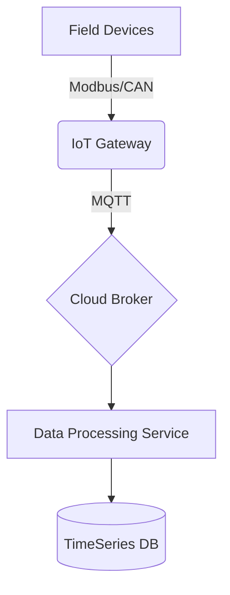

## Core Projects

### 1. IoT Gateway for Power Systems (STM32 + Golang)
*Designed and implemented a high-performance industrial gateway.*
- **Hardware**: STM32H7 based custom board.
- **Software**: Golang application running on Linux (Yocto), C firmware for MCU.
- **Protocols**: MQTT, Modbus RTU/TCP, IEC-104.
- **Key Features**: Edge computing, local data caching, OTA updates.

### 2. High-Availability BMS (Battery Management System)
*Architected a distributed BMS for large-scale energy storage.*
- **Architecture**: Master-Slave topology with CAN bus communication.
- **Role**: Lead Architect & Firmware Engineer.
- **Tech Stack**: C/C++, FreeRTOS, CANopen.

### 3. Cloud Energy Management Platform (EMS)
*Backend development for a SaaS energy monitoring platform.*
- **Tech Stack**: Golang (Gin), PostgreSQL, Redis, Docker, Kubernetes.
- **Focus**: Real-time data processing, high concurrency handling.

## System Architectures

*(Placeholders for diagrams - e.g., Mermaid charts or images)*

