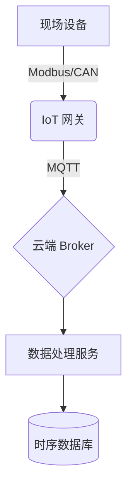

## 核心项目

### 1. 电力物联网网关 (STM32 + Golang)
*设计并实现高性能工业网关。*
- **硬件**: 基于 STM32H7 的定制主板。
- **软件**: 运行在 Linux (Yocto) 上的 Golang 应用, MCU 的 C 固件。
- **协议**: MQTT, Modbus RTU/TCP, IEC-104。
- **关键特性**: 边缘计算, 本地数据缓存, OTA 升级。

### 2. 高可用电池管理系统 (BMS)
*架构设计用于大规模储能的分布式 BMS。*
- **架构**: 基于 CAN 总线的主从拓扑。
- **角色**: 首席架构师 & 固件工程师。
- **技术栈**: C/C++, FreeRTOS, CANopen。

### 3. 云端能源管理平台 (EMS)
*SaaS 能源监控平台的后端开发。*
- **技术栈**: Golang (Gin), PostgreSQL, Redis, Docker, Kubernetes。
- **重点**: 实时数据处理, 高并发处理。

## 系统架构

*(图表占位符 - 例如 Mermaid 图表或图片)*

