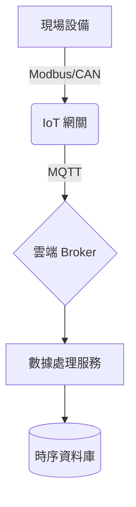

## 核心專案

### 1. 電力物聯網網關 (STM32 + Golang)
*設計並實現高性能工業網關。*
- **硬體**: 基於 STM32H7 的定制主板。
- **軟體**: 運行在 Linux (Yocto) 上的 Golang 應用, MCU 的 C 固件。
- **協議**: MQTT, Modbus RTU/TCP, IEC-104。
- **關鍵特性**: 邊緣計算, 本地數據緩存, OTA 升級。

### 2. 高可用電池管理系統 (BMS)
*架構設計用於大規模儲能的分佈式 BMS。*
- **架構**: 基於 CAN 總線的主從拓撲。
- **角色**: 首席架構師 & 固件工程師。
- **技術棧**: C/C++, FreeRTOS, CANopen。

### 3. 雲端能源管理平台 (EMS)
*SaaS 能源監控平台的後端開發。*
- **技術棧**: Golang (Gin), PostgreSQL, Redis, Docker, Kubernetes。
- **重點**: 實時數據處理, 高併發處理。

## 系統架構

*(圖表占位符 - 例如 Mermaid 圖表或圖片)*

